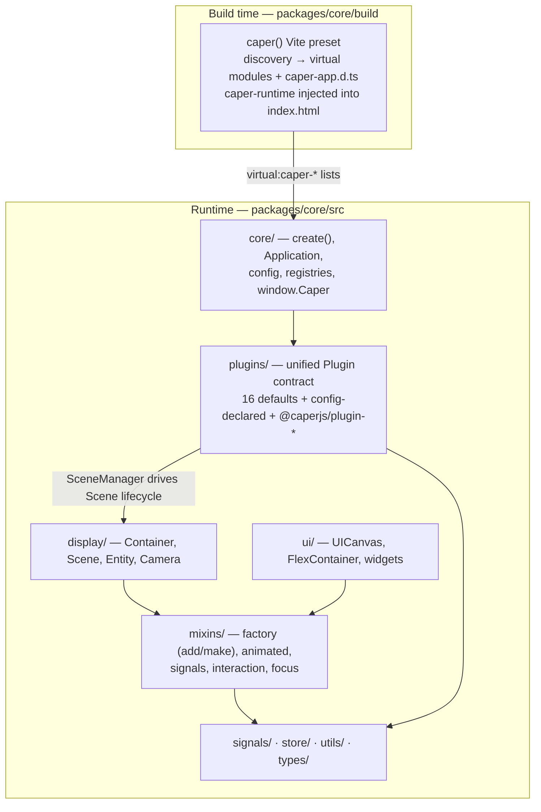

# Architecture Overview

> Part of the Caper core wiki. Index: [Home](Home.md)

Caper is an opinionated HTML game framework over PixiJS v8. It adds what Pixi (a renderer) doesn't have: an application lifecycle, a plugin system, scene management, a factory-based display layer, screen-space UI, and a Vite build pipeline that discovers game content by convention. It is a fork of dill-pixel with a unified plugin contract (storage adapters are just plugins) and a narrowed scope.

## The layers

## How a game boots

1. **Build time.** The `caper()` Vite preset ([build/index.mjs](../../packages/core/build/index.mjs)) *parses* (never imports) app source with an AST scanner, finds `defineScene`/`defineEntity`/`definePopup`/`defineUI`/`definePlugin` markers, and emits `virtual:caper-*` list modules plus a generated `caper-app.d.ts` for literal-typed ids. It injects a `caper-runtime` module import into `index.html`, so apps need no entry file.
2. **`create(config)`** ([src/core/create.ts](../../packages/core/src/core/create.ts)) prepares the browser environment and instantiates the app class (`config.application`, default `Application`, a Pixi `Application` subclass).
3. **Phase 1 — `preInitialize`**: pre-renderer plugins (dev tools, GSAP, store).
4. **Phase 2 — `initialize`**: Pixi renderer init → the 16 default plugins in the fixed order of [plugins/defaults.ts](../../packages/core/src/plugins/defaults.ts) → stage assembly → config-declared plugins, topologically sorted by their `requires` lists → default scene load via SceneManagerPlugin.
5. **Phase 3 — `postInitialize`**: every plugin's `postInitialize`, PWA/visibility wiring, then the app's own overridable hook.
6. `globals.ts` registers the app on `window.Caper` (`apps`, `ready()`, and — when gated on — the `automation` facade). It reads no browser global at module load, because the built entry is also evaluated in Node during SSR config loading.

## How plugins publish capability

A plugin extends `Plugin<Options>` and surfaces its API three ways:

- a lazy typed accessor on `Application` (`app.assets`, `app.audio`, `app.scenes`, …),
- named functions pushed into the **core function registry** (`app.func` / `app.exec`),
- named signals pushed into the **core signal registry** (`app.signal`).

The registries are flat module-level maps ([src/core/registries.ts](../../packages/core/src/core/registries.ts)) populated from `getCoreFunctions()`/`getCoreSignals()` *before* `initialize` runs. Storage is duck-typed: any plugin with `save`/`load` is storage-capable, and `Store` routes to it through the plugin registry. Plugin errors during boot are caught and emitted on `app.onPluginError` rather than aborting.

## How the display layer works

`Container` ([src/display/Container.ts](../../packages/core/src/display/Container.ts)) is the one deep base: Pixi's `Container` wrapped with the factory mixin (`this.add.*` creates and parents, `this.make.*` only creates), GSAP animation scoping, auto-disconnecting signal connections, and a lifecycle (`added`/`removed`/`resize`/`update`) wired to Pixi events, `app.onResize`, and the ticker. `Scene` adds an externally driven lifecycle (`initialize`/`enter`/`start`/`exit`) — SceneManagerPlugin calls those, not Pixi. `Entity` adds typed props. UI (`UICanvas` + `FlexContainer` + widgets) sits on `@pixi/layout` (Yoga flexbox), not hand-rolled transform math.

## Cross-system communication

`typed-signals`, wrapped in [src/signals/Signal.ts](../../packages/core/src/signals/Signal.ts) with priority ordering and once/N-times helpers. Bare `Signal`s never clean themselves up; the `WithSignals` mixin gives display objects (and `Plugin` gives plugins) a connection bag that disconnects on destroy. Actions are the input-side bus: `app.action(id, data)` dispatches through ActionsPlugin, gated by a single current **action context** string.

## Design disciplines to preserve

- **The import-cycle discipline.** The factory method table needs every display/UI class; those classes need the factory mixin. The cycle is defused by (a) display/UI files importing mixins from *concrete files*, never the `mixins` barrel, (b) a zero-import registration slot (`mixins/factory/defaults.ts`) that `Factory()` reads lazily at construction, and (c) six entry-order guard tests (`src/importOrder.*.test.ts`). Never add a barrel import inside `display/`, `ui/`, or `mixins/factory/`. Details: [Mixins & the Factory](mixins-and-factory.md).
- **Parse, don't import, at build time.** The framework entry bundles `@pixi/sound` and GSAP, which throw in plain Node. Build plugins scan the AST; the one true evaluation (`validateCaperConfig`) wraps `ssrLoadModule` in a scoped, non-clobbering `document`/`window` stub. Details: [Build pipeline](build-pipeline.md).
- **App type augmentation.** Consumer apps get literal-typed scene/plugin/action ids by the build regenerating `caper-app.d.ts`, which augments `AppTypeOverrides`. New id-bearing concepts should plug into that same mechanism.
- **Convention over registration.** New scenes/entities/popups/UI are picked up by discovery, not manual lists; new capability belongs in a plugin, not ad-hoc app code.

## Where to add things

| You want to… | Go to |
|---|---|
| Add a game-facing capability (service, third-party SDK) | New plugin — [Plugins: Contract & Lifecycle](plugins-architecture.md) |
| Add a constructible display type to `this.add.*` | Factory schema — [Mixins & the Factory](mixins-and-factory.md) |
| Add a UI widget | Subclass `Container`, compose mixins — [UI](ui.md) |
| Add a new discovered kind (like scenes/popups) | Discovery + list plugin + d.ts — [Build pipeline](build-pipeline.md) |
| Add a config option | [Core: Application & Bootstrap](core-application.md) recipes |
| Add a scaffolding command | [CLI, Templates & Package Surface](cli-and-package.md) |
